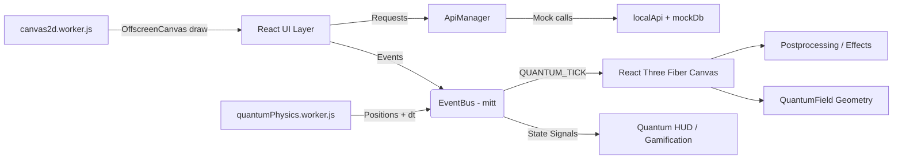

# EcoSpend Architecture

## System Overview
EcoSpend is a React + Three.js front-end that renders a persistent quantum-space background while delivering a full banking experience using a mock backend. The UI is event-driven and worker-accelerated to keep the main thread responsive.

## High-Level Diagram

## User Flow (Conceptual)
1. Login / Sign Up → Authenticated user session
2. Dashboard → Balance + Gravity Well + Transactions
3. Transfer → Beneficiary + Beam → Balance update
4. EcoAI → Financial advisor chat
5. EcoMall → Purchase flow with balance deduction
6. Support → Ticket submission + admin reply
7. Admin → Users, cards, tickets, products

## Theme Consistency
The quantum-space theme is maintained via:
- Global CSS variables in `src/assets/css/globals.css`
- Shared fonts (`--font-display`, `--font-data`, `--font-body`)
- Consistent cosmic colors and glow tokens
- Persistent Three.js background canvas

## Three.js + Worker Architecture
- `QuantumField` renders GPU points and uses `frameloop="demand"`
- A physics worker computes particle positions and posts them via `postMessage` using transferable buffers
- EventBus dispatches `QUANTUM_TICK` updates to the scene
- OffscreenCanvas worker draws 2D visualizations (gravity well, wave displays, transfer beams)

## Lazy Loading + Demand Rendering
- Heavy components are `React.lazy` + `Suspense` loaded
- R3F canvas only renders on `invalidate()` triggered by worker ticks
- Adaptive DPR + postprocessing quality via `PerformanceMonitor`

## Zero-Copy Buffer Strategy
- Worker maintains a small pool of `Float32Array` buffers
- Main thread receives a buffer, writes directly to `BufferAttribute`
- Buffer is returned to the worker for reuse

## Folder Structure
- `src/pages/` → major UI pages (Login, SignUp, Dashboard, EcoAI, EcoMall, etc.)
- `src/components/` → shared UI building blocks and shells
- `src/workers/` → heavy computation + OffscreenCanvas rendering
- `src/lib/` → EventBus, physics, zero-copy helpers, toast system
- `src/data/` → mock database + local API
- `src/hooks/` → worker hooks and utilities
- `src/three/` → legacy 3D shell (now deprecated)

## Routing Map (Core)
- `/auth` → Login
- `/register` → Quantum Sign Up
- `/main/*` → App Shell + all authenticated sections
- `/admin` → Admin Portal (mock)
